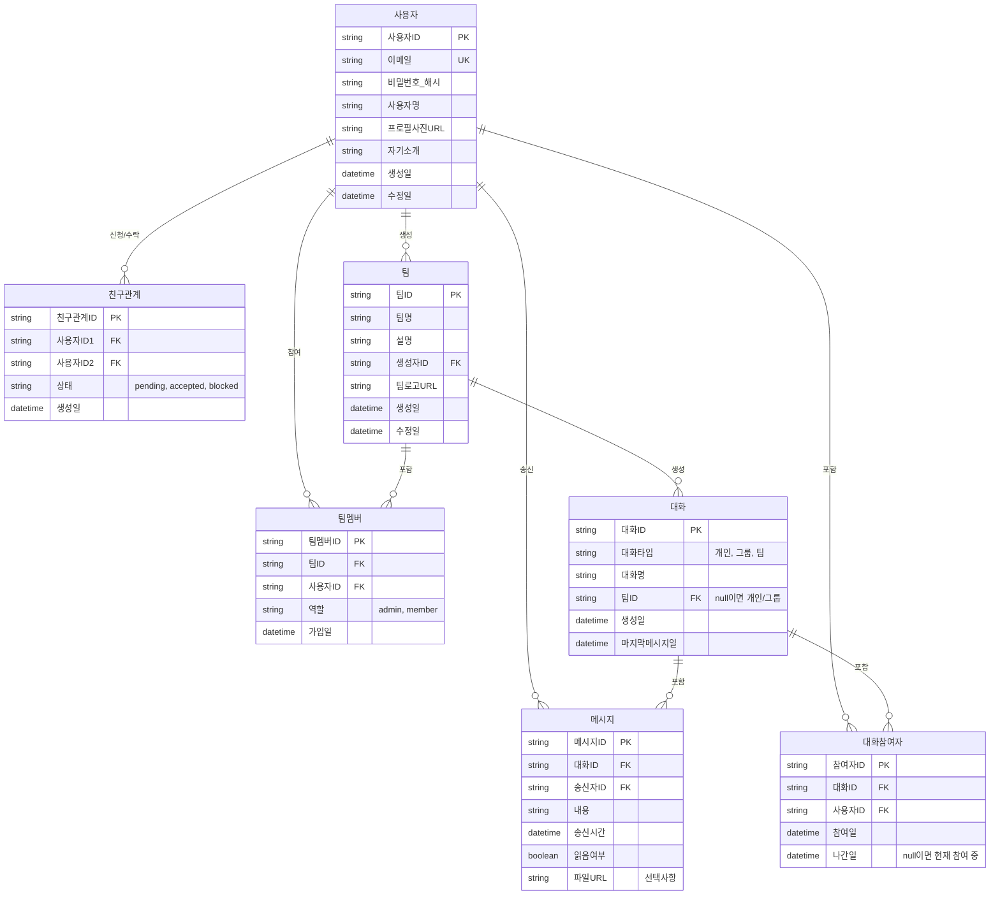

# Agora 서비스 ERD (Entity Relationship Diagram)



## 테이블 상세 설명

### 📌 사용자 (Users)
- **사용자ID**: 고유 식별자
- **이메일**: 로그인/복구용 (중복 불가)
- **사용자명**: 프로필에 표시되는 이름
- **프로필사진URL**: AWS S3 등의 URL
- **자기소개**: 프로필 bio

### 👥 친구관계 (Friendships)
- **상태**: pending(대기중), accepted(승인), blocked(차단)
- **사용자ID1, ID2**: 친구 신청자와 수신자

### 🏢 팀 (Teams)
- **팀ID**: 팀 고유 식별자
- **생성자ID**: 팀을 만든 사용자 (admin 권한)
- **팀로고URL**: 팀 프로필 이미지

### 👤 팀멤버 (Team_Members)
- **역할**: admin(관리자), member(일반 멤버)
- 팀과 사용자의 다대다 관계 연결

### 💬 대화 (Conversations)
- **대화타입**: 개인(1:1), 그룹(여럿), 팀(팀 채팅)
- **팀ID**: 팀 채팅인 경우만 입력, NULL이면 개인/그룹
- **마지막메시지일**: 최근 활동 표시용

### 👫 대화참여자 (Conversation_Participants)
- **나간일**: NULL이면 현재 참여 중, 값이 있으면 나감
- 대화와 사용자의 다대다 관계

### 📨 메시지 (Messages)
- **읽음여부**: 1:1 개인 대화에서 읽음 상태 추적
- **파일URL**: 이미지, 첨부파일 저장
- 인덱스: `(대화ID, 송신시간)` - 메시지 조회 최적화

## 주요 관계

| 관계 | 설명 |
|------|------|
| 사용자 → 친구관계 | 1명의 사용자는 여러 친구 신청/수락 |
| 사용자 → 팀 | 1명이 여러 팀 생성 가능 |
| 팀 ← 팀멤버 → 사용자 | 팀과 사용자의 다대다 관계 |
| 사용자 → 메시지 | 1명이 여러 메시지 송신 |
| 대화 ← 메시지 | 1개 대화가 여러 메시지 포함 |
| 대화 ← 대화참여자 → 사용자 | 대화와 사용자의 다대다 관계 |

## 추가 고려사항

### 🔐 보안
```sql
-- 암호화된 필드
ALTER TABLE 사용자 ADD COLUMN 전화번호_암호화 VARCHAR(255);

-- JWT 토큰 저장 (선택)
-- 로그인 세션 관리용
CREATE TABLE 세션 (
    세션ID STRING PRIMARY KEY,
    사용자ID STRING FK,
    토큰 STRING,
    만료시간 DATETIME,
    생성일 DATETIME
);
```

### 🔔 알림 (Notifications)
```sql
CREATE TABLE 알림 (
    알림ID STRING PRIMARY KEY,
    수신자ID STRING FK,
    알림타입 STRING, -- "친구요청", "새메시지", "팀초대"
    관련객체ID STRING,
    읽음여부 BOOLEAN,
    생성일 DATETIME
);
```

### 📁 파일 관리 (Files)
```sql
CREATE TABLE 파일 (
    파일ID STRING PRIMARY KEY,
    업로드자ID STRING FK,
    파일명 STRING,
    파일크기 BIGINT,
    파일타입 STRING, -- "image", "document", "video"
    S3경로 STRING,
    생성일 DATETIME
);
```

### 📊 인덱스 전략
```sql
-- 성능 최적화를 위한 주요 인덱스
CREATE INDEX idx_친구관계_사용자 ON 친구관계(사용자ID1, 사용자ID2);
CREATE INDEX idx_메시지_대화시간 ON 메시지(대화ID, 송신시간);
CREATE INDEX idx_대화참여자_사용자 ON 대화참여자(사용자ID, 대화ID);
CREATE INDEX idx_팀멤버_팀 ON 팀멤버(팀ID);
CREATE INDEX idx_팀멤버_사용자 ON 팀멤버(사용자ID);
```

---

**데이터베이스 선택 추천:**
- **PostgreSQL**: 관계형 데이터, 트랜잭션 보장 필수
- **Redis**: 메시지 캐싱, 실시간 상태 저장
- **MongoDB**: 유연한 스키마 필요시 (선택)
