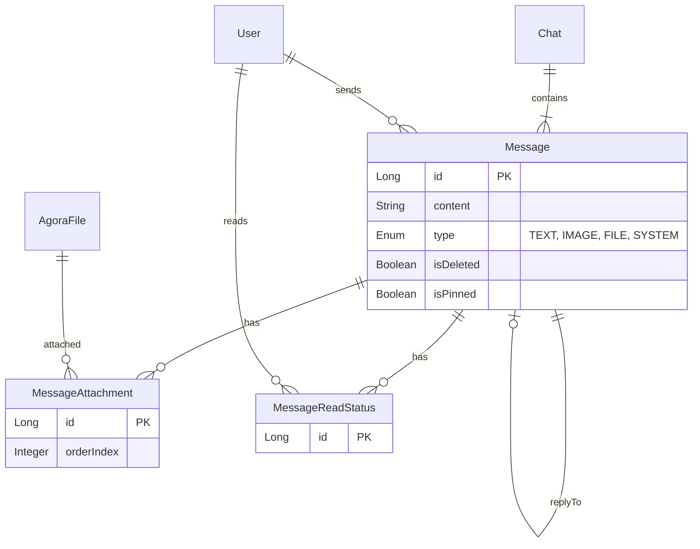

# Agora Module ERD

Agora 모듈 23개 Entity의 ERD (도메인별 분리)

---

## 1. User & Profile

---

## 2. Chat

---

## 3. Message

---

## 4. Team

---

## 5. Social

---

## 6. File & Notification

---

## Entity 요약

| 도메인 | Entity | 개수 |
|--------|--------|------|
| User & Profile | AgoraUserProfile, TeamProfile, UserSettings | 3 |
| Chat | Chat, ChatParticipant, ChatFolder, ChatFolderItem | 4 |
| Message | Message, MessageAttachment, MessageReadStatus | 3 |
| Team | Team, TeamMember, TeamRole, Notice, Todo, Event | 6 |
| Social | Friend, FriendRequest, BlockedUser | 3 |
| File & Notification | AgoraFile, FileMetadata, Notification, FcmToken | 4 |
| **합계** | | **23** |
